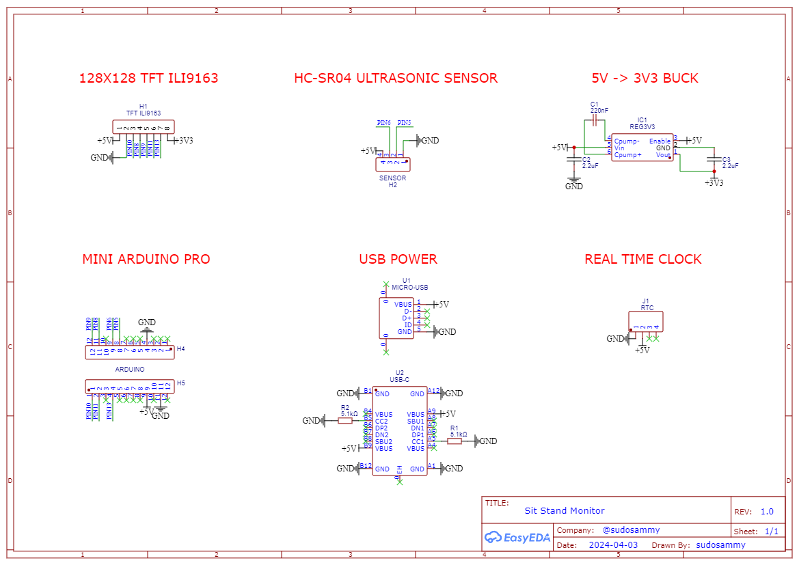
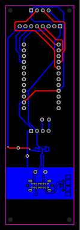
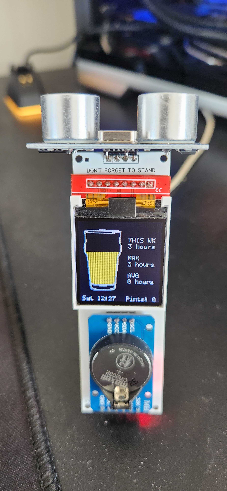
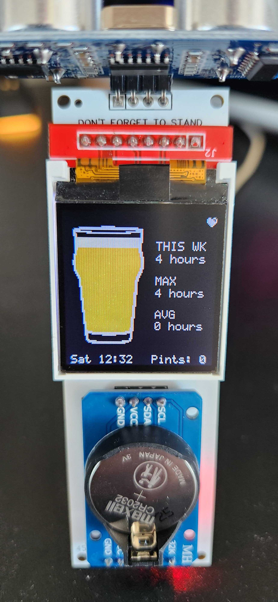

# Standing reminder for my site/stand desk

An arduino (ATmega328p) toy to track the time I spend standing at my desk per work week. It uses an ultrasonic sensor to measure the distance between the desk and roof to determine sit/stand status, and a real time clock to accurately track time spent standing.

The TFT screen displays the current weeks' stand time, the maximum weekly time recorded standing, and a rolling monthly average.

The pint glass fills with time spent standing. `1 pint = 5 hours`. Standing burns approximately 50 calories per hour more than sitting, and there's approximately 250 calories in a pint of beer!

## Components

- [RTC Clock Module](https://www.aliexpress.com/item/1005006174455227.html)
- [5v Pro Mini 328 (Sparksfun Arduino Pro Mini Clone)](https://www.aliexpress.com/item/1005006208910800.html)
- [Ultrasonic Sensor](https://www.aliexpress.com/item/1005006064482070.html)
- [1.44" TFT Screen](https://www.aliexpress.com/item/1005003152078101.html)
- [5v -> 3.3v buck converter](https://www.aliexpress.com/item/1005002168374063.html) - I build this into the PCB for production

Total Cost: ~12 AUD

## Pics

